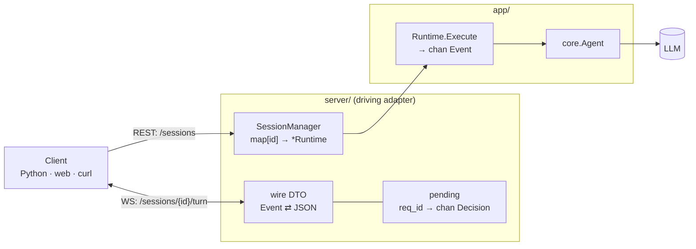
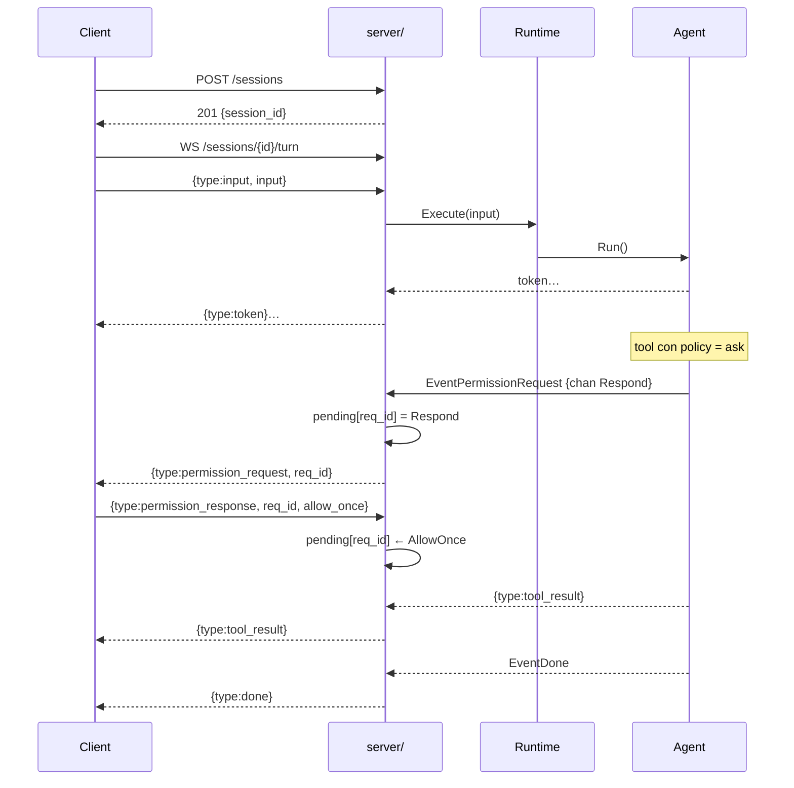
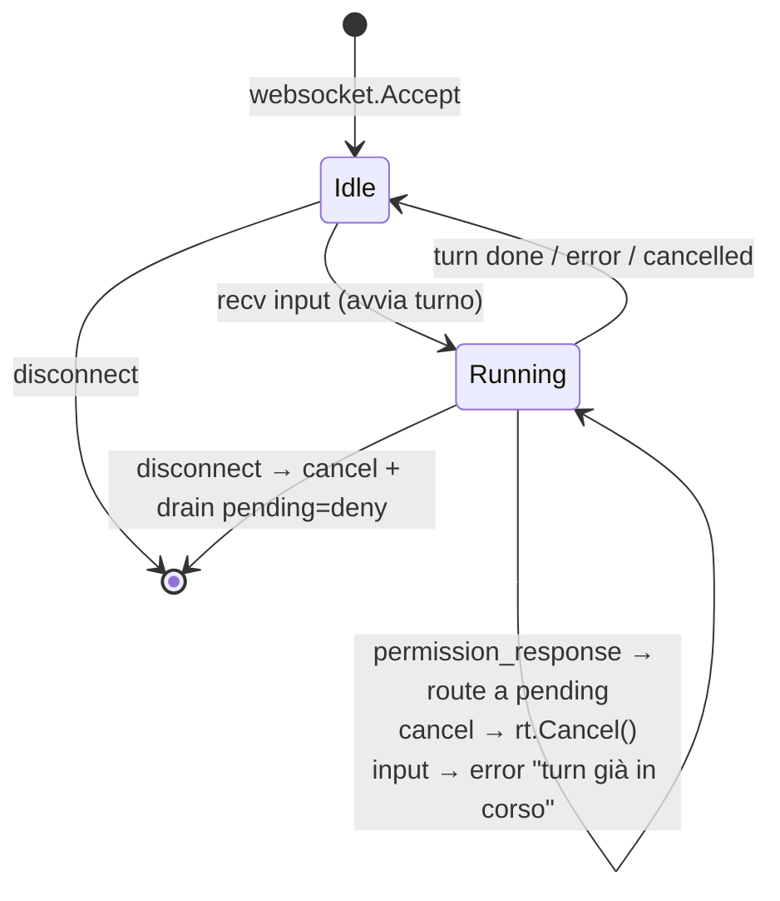

# Agent Server — HTTP/WebSocket

L'**agent server** espone un agente definito da manifest su rete, così da pilotarlo da fuori
(script Python, web, `curl`). È un *driving adapter* (`server/`): traduce la rete in chiamate al
`Runtime`, e `app/` non sa nulla di HTTP.

```bash
mani serve --config agent.yaml --addr :9000
```

## Due piani

| Piano | Protocollo | A cosa serve |
|---|---|---|
| **Control plane** | REST/JSON | creare, elencare, chiudere sessioni |
| **Data plane** | WebSocket | eseguire un turno: stream di eventi + risposte ai permessi |

Una **sessione** = un `Runtime` isolato (un `Build(spec)` a sé). La chiavi con un `session_id`,
poi apri un WebSocket su quella sessione per ogni turno.

---

## Diagramma di comunicazione



---

## REST — control plane

Base URL: `http://<host>:<addr>` (default `:9000`). Corpo e risposte sono JSON.

### `POST /sessions`

Crea una nuova sessione (costruisce un `Runtime` dal manifest del server).

**Request:** nessun corpo.

**Response `201 Created`:**
```json
{ "session_id": "a1b2c3d4e5f6a7b8" }
```

```bash
curl -s -XPOST http://localhost:9000/sessions
```

### `GET /sessions`

Elenca gli id delle sessioni attive.

**Response `200 OK`:**
```json
{ "sessions": ["a1b2c3d4e5f6a7b8", "..."] }
```

```bash
curl -s http://localhost:9000/sessions
```

### `DELETE /sessions/{id}`

Chiude una sessione e libera le sue risorse (incluse le connessioni MCP).

**Response:** `204 No Content` — oppure `404 Not Found` se l'id non esiste.

```bash
curl -s -XDELETE http://localhost:9000/sessions/a1b2c3d4e5f6a7b8
```

---

## WebSocket — data plane

```
WS /sessions/{id}/turn
```

Un WebSocket = **un turno**. Apri la connessione, mandi l'input, ricevi lo stream di eventi, il
turno finisce con `done` (o `error`/`cancelled`). I messaggi sono JSON, uno per frame.

### Messaggi client → server

| `type` | Campi | Quando |
|---|---|---|
| `input` | `input` (string) | **primo** frame: avvia il turno con il prompt |
| `permission_response` | `request_id`, `decision` | risposta a un `permission_request` |
| `cancel` | — | interrompe il turno in corso (equivale a ESC) |

`decision` ∈ `allow_once` · `allow_always` · `deny` (qualsiasi altro valore = `deny`).

```json
{ "type": "input", "input": "che tool hai a disposizione?" }
{ "type": "permission_response", "request_id": "9f8e7d", "decision": "allow_once" }
{ "type": "cancel" }
```

### Messaggi server → client

| `type` | Payload | Significato |
|---|---|---|
| `token` | `{ text }` | pezzo di risposta del modello (streaming) |
| `thinking` | `{ text }` | ragionamento (solo se il thinking è attivo) |
| `tool_call` | `{ name, input }` | il modello sta per invocare un tool |
| `tool_result` | `{ name, result, is_error }` | esito del tool |
| `usage` | `{ input, output }` | token consumati |
| `permission_request` | `{ request_id, tool_name, risk_level, input, preview }` | serve un'approvazione |
| `done` | — | turno concluso con successo |
| `error` | `{ message }` | turno fallito |
| `cancelled` | — | turno interrotto |

I payload sono sotto la chiave `payload`:

```json
{ "type": "token", "payload": { "text": "Ho a disposizione " } }
{ "type": "tool_result", "payload": { "name": "read", "result": "...", "is_error": false } }
{ "type": "permission_request", "payload": {
    "request_id": "9f8e7d", "tool_name": "bash", "risk_level": "execute",
    "input": { "cmd": "ls -la" }, "preview": "ls -la" } }
{ "type": "done" }
```

---

## Il flusso dei permessi

Un tool con policy `ask` nel manifest **sospende** il turno finché il client non decide. Il canale
di risposta interno non attraversa il filo: il server lo sostituisce con un `request_id` e tiene
una mappa `request_id → canale`. La tua risposta (`permission_response` con lo stesso `request_id`)
sblocca il tool.



Note:
- I tool con policy `allow`/`deny` **non** emettono `permission_request` (decisi in silenzio): il
  round-trip avviene **solo** per `ask`.
- Se il client si disconnette con permessi pendenti, vengono risolti a `deny` (fail-closed).
- Un client **headless** (che non vuole approvare a mano) risponde `deny` — o applica la propria
  policy — sullo stesso messaggio.

---

## Macchina a stati WS



## Esempio completo

```bash
# 1. crea la sessione
SID=$(curl -s -XPOST http://localhost:9000/sessions | jq -r .session_id)

# 2. apri il turno (con websocat) e manda l'input
websocat ws://localhost:9000/sessions/$SID/turn
> {"type":"input","input":"leggi go.mod e dimmi il modulo"}
< {"type":"token","payload":{"text":"Il modulo "}}
< {"type":"tool_call","payload":{"name":"read","input":{"path":"go.mod"}}}
< {"type":"tool_result","payload":{"name":"read","result":"module github.com/...","is_error":false}}
< {"type":"token","payload":{"text":"è github.com/Federicoand98/mani"}}
< {"type":"done"}

# 3. chiudi la sessione
curl -s -XDELETE http://localhost:9000/sessions/$SID
```

---

## Limiti attuali

- **Nessuna auth:** niente token/API key. Non esporlo fuori da localhost così com'è.
- **Un turno per WebSocket:** la connessione serve un turno; per il turno successivo riapri il WS
  (la sessione e la sua memoria restano).
- **Nessun timeout sul permesso:** se apri il turno, ricevi `permission_request` e non rispondi mai
  (senza disconnetterti), il turno resta sospeso.
- **Un `Runtime` per sessione:** turni concorrenti sulla stessa sessione non sono supportati; usa
  sessioni distinte.
