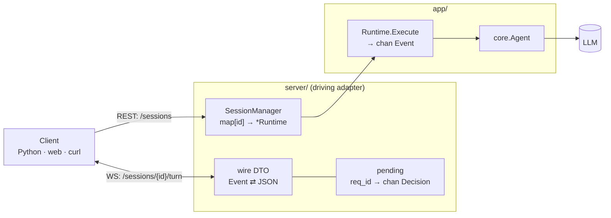
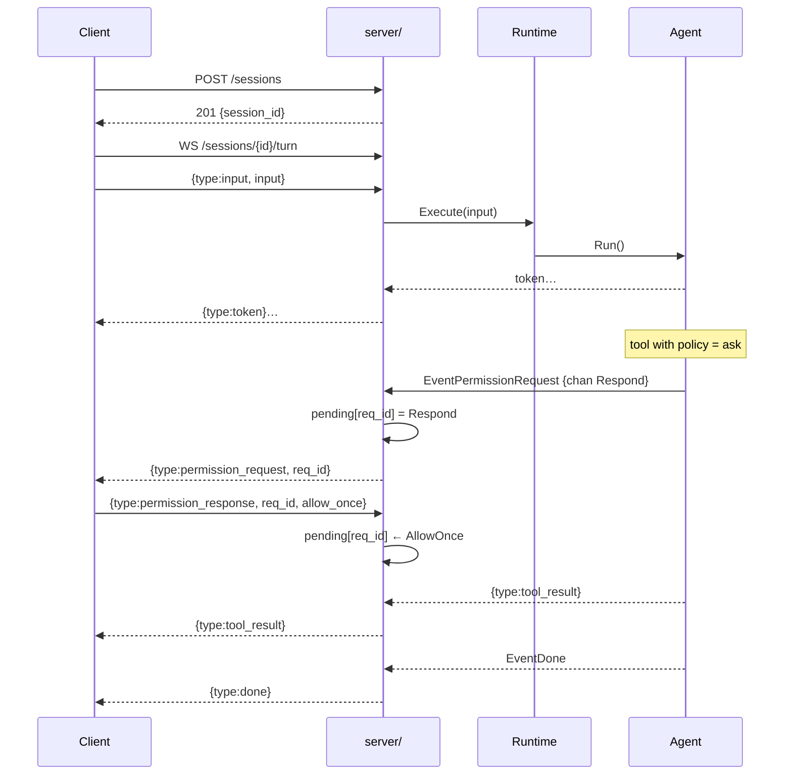
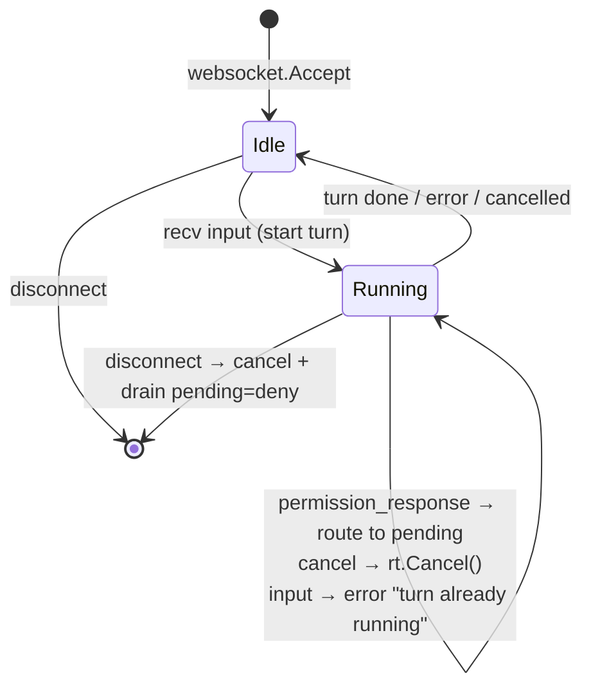

# Agent Server — HTTP/WebSocket

The **agent server** exposes a manifest-defined agent over the network, so you can drive it from
outside (a Python script, a web page, `curl`). It is a *driving adapter* (`server/`): it
translates the network into `Runtime` calls, and `app/` knows nothing about HTTP.

```bash
export MANI_SERVER_TOKEN=secret
mani serve --config agent.yaml --addr :9000

mani serve --config agent.yaml --insecure   # dev only: no auth, refuses to start otherwise
```

## Two planes

| Plane | Protocol | What it's for |
|---|---|---|
| **Control plane** | REST/JSON | create, list and close sessions; read the run journal |
| **Data plane** | WebSocket | run turns: event stream + permission answers |

A **session** = an isolated `Runtime` (its own `Build(spec)`). You get one with a `session_id`,
then you open a WebSocket on that session to run turns.

**Authentication.** Every route sits behind a bearer token
(`Authorization: Bearer $MANI_SERVER_TOKEN`), including the WebSocket upgrade — the handshake is
an HTTP GET, so a single middleware covers both planes. The server refuses to start without a
token unless `--insecure` is passed explicitly.

---

## Communication diagram



---

## REST — control plane

Base URL: `http://<host>:<addr>` (default `:9000`). Bodies and responses are JSON.
All examples assume `-H "Authorization: Bearer $MANI_SERVER_TOKEN"`.

### `POST /sessions`

Creates a new session (builds a `Runtime` from the server's manifest).

**Request:** no body.

**Response `201 Created`:**
```json
{ "session_id": "a1b2c3d4e5f6a7b8" }
```

```bash
curl -s -XPOST -H "Authorization: Bearer $MANI_SERVER_TOKEN" http://localhost:9000/sessions
```

### `GET /sessions`

Lists the ids of the active sessions.

**Response `200 OK`:**
```json
{ "sessions": ["a1b2c3d4e5f6a7b8", "..."] }
```

### `DELETE /sessions/{id}`

Closes a session and releases its resources (including MCP connections).

**Response:** `204 No Content` — or `404 Not Found` if the id doesn't exist.

### `POST /sessions/{id}/chat` and `POST /chat`

A single turn over plain HTTP, with no streaming: useful for scripts and for one-shot use.
`/chat` is stateless — it builds a throwaway `Runtime` for the request.

**Request:**
```json
{ "input": "summarize README.md" }
```

**Response `200 OK`:**
```json
{ "output": { "response": "..." }, "usage": { "input": 1120, "output": 88 } }
```

`output` carries the structured result when the manifest declares an `output.schema`; otherwise
the text is wrapped as `{"response": "..."}`. On failure the body is
`{ "error": "...", "is_error": true }`. Permission requests are auto-denied here (fail-closed):
design manifests for this route with `allow`/`deny`, not `ask`.

### `GET /runs` and `GET /runs/{id}`

The run journal. `GET /runs` accepts `?session=`, `?limit=`, `?status=` (`ok` | `error` |
`cancelled`) and `?since=` (a duration such as `24h`) and returns run headers
(status, source, timings, token/tool/blocked counters); `GET /runs/{id}` returns the full record
including the event list.

Both return `501 Not Implemented` unless `observability.journal.path` is configured — the
cross-session view is served from the shared directory on disk, so a path is required.

```bash
curl -s -H "Authorization: Bearer $MANI_SERVER_TOKEN" "http://localhost:9000/runs?limit=5"
curl -s -H "Authorization: Bearer $MANI_SERVER_TOKEN" "http://localhost:9000/runs?status=error&since=24h"

The same filters are available offline with `mani runs --status error --since 24h`:
one vocabulary for HTTP and the terminal.
```

---

## WebSocket — data plane

```
WS /sessions/{id}/turn
```

One WebSocket carries **many turns**: you send an input, receive the event stream, and the turn
ends with `done` (or `error`/`cancelled`). The connection then returns to idle and accepts the
next input, so the conversation continues on the same socket. Messages are JSON, one per frame.

### Client → server messages

| `type` | Fields | When |
|---|---|---|
| `input` | `input` (string) | starts a turn with the prompt (rejected while one is running) |
| `permission_response` | `request_id`, `decision` | answer to a `permission_request` |
| `cancel` | — | interrupts the running turn (the equivalent of ESC) |

`decision` ∈ `allow_once` · `allow_always` · `deny` (any other value = `deny`).

```json
{ "type": "input", "input": "which tools do you have?" }
{ "type": "permission_response", "request_id": "9f8e7d", "decision": "allow_once" }
{ "type": "cancel" }
```

### Server → client messages

| `type` | Payload | Meaning |
|---|---|---|
| `token` | `{ text }` | a piece of the model's answer (streaming) |
| `thinking` | `{ text }` | reasoning (only when thinking is enabled) |
| `tool_call` | `{ name, input }` | the model is about to invoke a tool |
| `tool_result` | `{ name, result, is_error }` | the tool's outcome |
| `usage` | `{ input, output }` | tokens consumed |
| `permission_request` | `{ request_id, tool_name, risk_level, input, preview }` | approval needed |
| `structured` | the schema object | structured result, when `output.schema` is declared |
| `done` | — | turn completed successfully |
| `error` | `{ message }` | turn failed |
| `cancelled` | — | turn interrupted |

Payloads live under the `payload` key:

```json
{ "type": "token", "payload": { "text": "I have " } }
{ "type": "tool_result", "payload": { "name": "read", "result": "...", "is_error": false } }
{ "type": "permission_request", "payload": {
    "request_id": "9f8e7d", "tool_name": "bash", "risk_level": "execute",
    "input": { "cmd": "ls -la" }, "preview": "ls -la" } }
{ "type": "done" }
```

---

## The permission flow

A tool whose policy is `ask` **suspends** the turn until the client decides. The internal answer
channel never crosses the wire: the server replaces it with a `request_id` and keeps a
`request_id → channel` map. Your reply (`permission_response` with the same `request_id`)
unblocks the tool.



Notes:
- Tools with policy `allow`/`deny` do **not** emit a `permission_request` (they are decided
  silently): the round-trip happens **only** for `ask`.
- If the client disconnects with permissions pending, they resolve to `deny` (fail-closed).
- A **headless** client (one that won't approve by hand) answers `deny` — or applies its own
  policy — on the same message.

---

## WS state machine



A single reader-dispatcher goroutine owns the socket reads, and a single writer drains an
`outbound` channel (fan-in), so frames are never interleaved by concurrent writers.

## Full example

```bash
# 1. create the session
SID=$(curl -s -XPOST -H "Authorization: Bearer $MANI_SERVER_TOKEN" \
  http://localhost:9000/sessions | jq -r .session_id)

# 2. open the turn (with websocat) and send the input
websocat -H "Authorization: Bearer $MANI_SERVER_TOKEN" ws://localhost:9000/sessions/$SID/turn
> {"type":"input","input":"read go.mod and tell me the module"}
< {"type":"token","payload":{"text":"The module is "}}
< {"type":"tool_call","payload":{"name":"read","input":{"path":"go.mod"}}}
< {"type":"tool_result","payload":{"name":"read","result":"module github.com/...","is_error":false}}
< {"type":"token","payload":{"text":"github.com/Federicoand98/mani"}}
< {"type":"done"}

# 3. close the session
curl -s -XDELETE -H "Authorization: Bearer $MANI_SERVER_TOKEN" \
  http://localhost:9000/sessions/$SID
```

---

## Current limitations

- **No permission timeout:** if you start a turn, receive a `permission_request` and never answer
  (without disconnecting), the turn stays suspended.
- **One `Runtime` per session:** concurrent turns on the same session are not supported — the
  socket rejects a second `input` while one is running. Use separate sessions for parallelism.
- **No session garbage collection:** sessions live until `DELETE` or process exit.
- **Journal requires a path:** `GET /runs` needs `observability.journal.path`; the in-memory
  journal is per-session and cannot serve a unified view.
