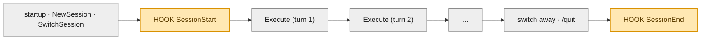
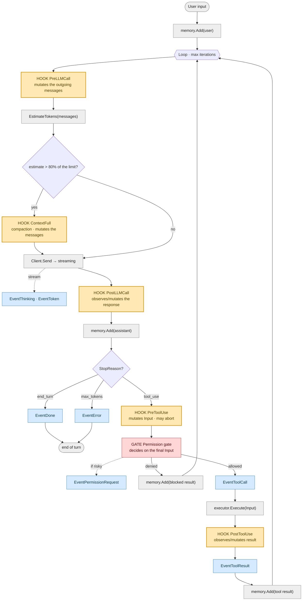

# Agentic loop & hook lifecycle

A map of `mani`'s agent loop, with the exact points where **hooks** fire, where the
**permission gate** acts, and where **events** are emitted towards the UI.

## Legend

| Symbol | Meaning |
|---|---|
| **Hook** (yellow) | a middleware point. It can observe, **mutate** the payload, or abort (`error`) |
| **Gate** (red) | NOT a hook: a mechanism of its own, deciding on the *final* input (post-mutation) |
| **Event** (blue) | emitted by the `Emitter` towards the UI. It does not interrupt the loop |
| grey | an internal step of the Agent |

Two layers: the **loop** hooks (`PreLLMCall`, `ContextFull`, `PostLLMCall`, `PreToolUse`,
`PostToolUse`) are fired by the **core** inside `Run`. The **session** hooks (`SessionStart`,
`SessionEnd`) are fired by the orchestrator (**app/Runtime**) at the session boundaries.

---

## 1. Session lifecycle (app)

Each `Execute` expands into the loop of diagram 2.

---

## 2. The agent loop (core) — inside one `Execute`

**Orderings that matter:**
- *Injection before estimation*: `PreLLMCall` prepends the system prompt, then `EstimateTokens`
  counts — so the system prompt is part of the count.
- *Compaction after estimation, before Send*: `ContextFull` trims the actual context you are
  about to send.
- *Mutate, then gatekeep*: `PreToolUse` may rewrite `Input`, and **then** the permission gate
  decides on that final input → no TOCTOU.

---

## 3. Hook reference table

| Hook | When it fires | Layer | Can mutate | On `error` | Payload |
|---|---|---|---|---|---|
| **SessionStart** | session created/switched | app | — | best-effort (ignored) | `*SessionEventPayload` |
| **PreLLMCall** | before every `Send` | core | `Messages` | aborts the Run | `*core.PreLLMCallPayload` |
| **ContextFull** | estimate > 80% of the limit (after injection) | core | `Messages` | aborts the Run | `*core.ContextFullPayload` |
| **PostLLMCall** | after the response, before storing it | core | `Response` | aborts the Run | `*core.PostLLMCallPayload` |
| **PreToolUse** | before every tool (phase 1) | core | `Input` | blocks *that* tool (`continue`) | `*core.PreToolUsePayload` |
| **PostToolUse** | after the tool executed | core | `Result`, `IsError` | aborts the Run | `*core.PostToolUsePayload` |
| **SessionEnd** | switch away / quit | app | — | best-effort (ignored) | `*SessionEventPayload` |

> The **permission gate** is not in the table because it is not a hook: it is invoked by the
> Agent *after* `PreToolUse`, on the final input. An observational hook (logging) must always
> return `nil` — an `error` means "stop".

---

## 4. Emitted events (towards the UI)

Distinct from hooks: **events** flow from the `Emitter` → channel → TUI for rendering, and do
not alter the loop.

`EventThinking` · `EventToken` · `EventToolCall` · `EventToolResult` ·
`EventPermissionRequest` · `EventUsage` · `EventDone` · `EventError` · `EventCancelled`
