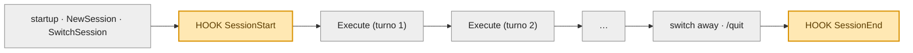
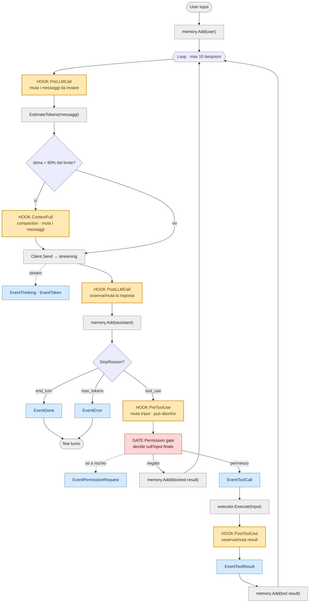

# Agentic loop & hook lifecycle

Mappa del ciclo dell'agente di `mani`, con i punti esatti in cui scattano gli **hook**,
dove agisce il **gate permesso** e dove vengono emessi gli **eventi** verso la UI.

## Legenda

| Simbolo | Significato |
|---|---|
| **Hook** (giallo) | punto di middleware. Può osservare, **mutare** il payload, o abortire (`error`) |
| **Gate** (rosso) | NON è un hook: meccanismo a sé, decide sull'input *finale* (post-mutazione) |
| **Evento** (azzurro) | emesso dall'`Emitter` verso la UI (REPL/TUI). Non interrompe il loop |
| grigio | Passo interno dell'Agent |

Due layer: gli hook di **loop** (`PreLLMCall`, `ContextFull`, `PostLLMCall`, `PreToolUse`,
`PostToolUse`) li spara il **core** dentro `Run`. Gli hook di **sessione** (`SessionStart`,
`SessionEnd`) li spara l'orchestratore (**app/Runtime**) ai confini della sessione.

---

## 1. Ciclo di vita della sessione (app)

Ogni `Execute` espande il loop del diagramma 2.

---

## 2. Il loop dell'agente (core) — dentro un `Execute`

**Ordini che contano:**
- *Injection prima della stima*: `PreLLMCall` antepone il system prompt, poi `EstimateTokens` conta — così il system entra nel conteggio.
- *Compaction dopo la stima, prima del Send*: `ContextFull` taglia il contesto reale che stai per inviare.
- *Muta poi gatekeeper*: `PreToolUse` può riscrivere `Input`, **poi** il permesso decide su quell'input finale → niente TOCTOU.

---

## 3. Tabella di riferimento degli hook

| Hook | Quando scatta | Layer | Può mutare | Su `error` | Payload |
|---|---|---|---|---|---|
| **SessionStart** | creazione/switch sessione | app | — | best-effort (ignorato) | `*SessionEventPayload` |
| **PreLLMCall** | prima di ogni `Send` | core | `Messages` | abort del Run | `*core.PreLLMCallPayload` |
| **ContextFull** | stima > 80% del limite (dopo injection) | core | `Messages` | abort del Run | `*core.ContextFullPayload` |
| **PostLLMCall** | dopo la risposta, prima di salvarla | core | `Response` | abort del Run | `*core.PostLLMCallPayload` |
| **PreToolUse** | prima di ogni tool (fase 1) | core | `Input` | blocca *quel* tool (`continue`) | `*core.PreToolUsePayload` |
| **PostToolUse** | dopo l'esecuzione del tool | core | `Result`, `IsError` | abort del Run | `*core.PostToolUsePayload` |
| **SessionEnd** | switch away / quit | app | — | best-effort (ignorato) | `*SessionEventPayload` |

> Il **Permission gate** non è in tabella perché non è un hook: è invocato dall'Agent
> *dopo* `PreToolUse`, su input finale. Un hook osservativo (logging) deve sempre
> ritornare `nil` — `error` significa "ferma".

---

## 4. Eventi emessi (verso la UI)

Distinti dagli hook: gli **eventi** fluiscono dall'`Emitter` → canale → REPL/TUI per il
rendering, e non alterano il loop.

`EventThinking` · `EventToken` · `EventToolCall` · `EventToolResult` ·
`EventPermissionRequest` · `EventDone` · `EventError`
