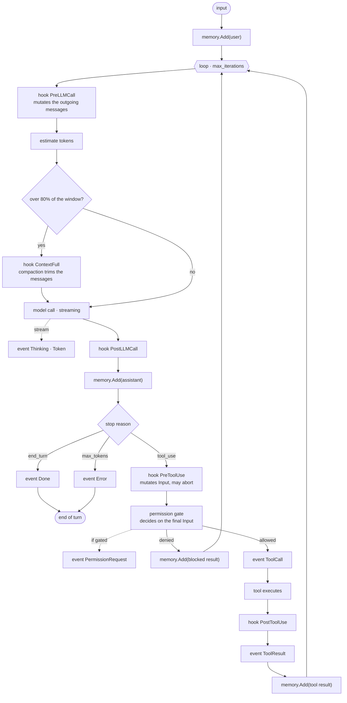

A turn starts with an input and ends with an answer or an error. In between, the agent calls the
model, the model may ask for a tool, the tool runs, and the result goes back into the
conversation. The loop repeats until the model stops asking for tools, or a limit stops the run.

Three kinds of thing attach to that loop, and they are not interchangeable:

- A **hook** is a middleware point. It can observe, mutate the payload, or abort.
- The **permission gate** is not a hook. It runs after the hooks and decides on the final input.
- An **event** flows outward to whatever is rendering the run. It never changes the loop.

## One turn

## Three orderings that matter

**Injection before estimation.** `PreLLMCall` prepends the system prompt, and the token estimate
runs after it. The prompt is part of the count, so a long prompt brings compaction forward
instead of silently blowing the window.

**Compaction after estimation, before the call.** `ContextFull` trims the messages that are about
to be sent, not a copy of them.

**Mutate, then gate.** `PreToolUse` may rewrite the tool input; the permission gate then decides
on that rewritten input. If the order were reversed, a hook could change an argument after it had
been approved, which is the classic check-then-use hole.

## The hooks

| Hook | Fires | Can mutate | On error |
|---|---|---|---|
| `SessionStart` | a session is created or switched to | — | ignored |
| `PreLLMCall` | before every model call | the messages | aborts the run |
| `ContextFull` | the estimate passes 80% of the window | the messages | aborts the run |
| `PostLLMCall` | after the response, before it is stored | the response | aborts the run |
| `PreToolUse` | before every tool call | the tool input | blocks that tool, the run continues |
| `PostToolUse` | after the tool returns | the result and its error flag | aborts the run |
| `SessionEnd` | switching away, or quitting | — | ignored |

`SessionStart` and `SessionEnd` are fired by the runtime at the session boundary; the other five
are fired by the core, inside the loop.


  An observational hook must return `nil`. Returning an error means "stop", so a logging hook
  that forwards a write failure will abort runs.


Governance is built out of these hooks and nothing else. `policy`, the pattern rules, the
redaction and the per-run budgets are hook registrations made by the runtime when it reads your
manifest, which is why the core needs no knowledge of them. See [governance](../governance/).

## The events

Events are what a user interface renders, and what `mani run` consumes to print a result:

`Thinking` · `Token` · `ToolCall` · `ToolResult` · `PermissionRequest` · `Usage` · `Done` ·
`Error` · `Cancelled`

The same stream feeds the terminal chat, the WebSocket of the agent server, and the journal. A
new surface renders the run by consuming events, without the loop knowing it exists.

Next: [governance](../governance/).
